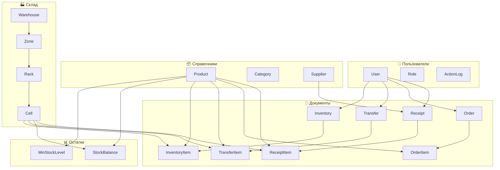
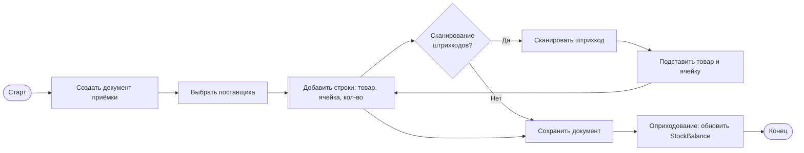
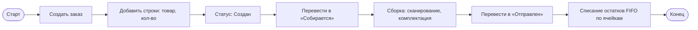
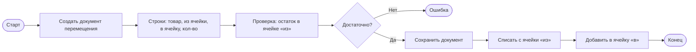
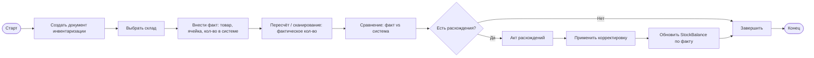
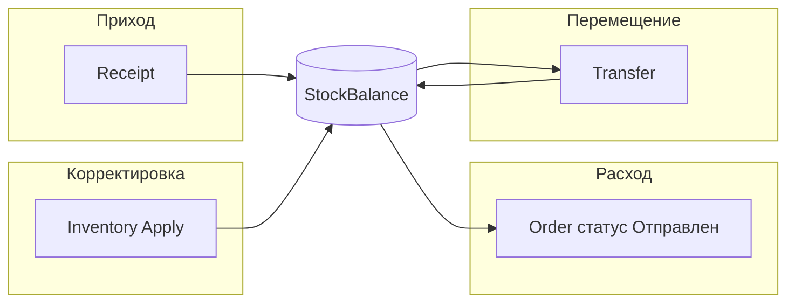

# Bashkent WMS — схема системы и BPMN

## 1. Архитектура системы (высокий уровень)

```
┌─────────────────────────────────────────────────────────────────────────────┐
│                              ПОЛЬЗОВАТЕЛЬ (браузер)                          │
│                    ru / uz / en · JWT · Accept-Language                       │
└─────────────────────────────────────────────────────────────────────────────┘
                                        │
                                        ▼
┌─────────────────────────────────────────────────────────────────────────────┐
│                         FRONTEND (React + Vite)                              │
│  Дашборд · Товары · Склад · Приём · Отгрузка · Остатки · Перемещение ·      │
│  Инвентаризация · Отчёты · Пользователи                                       │
└─────────────────────────────────────────────────────────────────────────────┘
                                        │
                              REST API (JSON) + JWT + Accept-Language
                                        │
                                        ▼
┌─────────────────────────────────────────────────────────────────────────────┐
│                         BACKEND (Django + DRF)                               │
│  API: /api/auth/ · /api/products/ · /api/warehouse/ · /api/receipts/ ·       │
│       /api/orders/ · /api/stock/ · /api/transfers/ · /api/inventory/ ·       │
│       /api/reports/ · /api/language/                                          │
│  Middleware: Locale, API Language, Audit (created_by/updated_by)              │
└─────────────────────────────────────────────────────────────────────────────┘
                                        │
                                        ▼
┌─────────────────────────────────────────────────────────────────────────────┐
│                            PostgreSQL                                         │
│  users · products · warehouse · stock · receipts · orders ·                  │
│  transfers · inventory · reports (логи)                                       │
└─────────────────────────────────────────────────────────────────────────────┘
```

---

## 2. Связи между модулями (данные)



---

## 3. BPMN: процесс «Приём товара»



**Роли:** Кладовщик, Менеджер.  
**Результат:** остатки в ячейках увеличены, запись в журнале (created_by, created_at).

---

## 4. BPMN: процесс «Отгрузка (заказ)»



**Роли:** Менеджер, Кладовщик.  
**Результат:** остатки уменьшены, заказ в статусе «Отправлен».

---

## 5. BPMN: процесс «Перемещение между ячейками»



**Роли:** Кладовщик.  
**Результат:** остатки пересчитаны в двух ячейках.

---

## 6. BPMN: процесс «Инвентаризация»



**Роли:** Кладовщик, Администратор.  
**Результат:** остатки приведены к фактическому наличию.

---

## 7. Общий поток данных по остаткам (StockBalance)



---

## 8. Что можно сделать дальше

### 8.1 Функциональность

| Направление | Что сделать |
|-------------|-------------|
| **Сканирование** | Поддержка сканера штрихкодов в UI (поле ввода + Enter), автоподстановка товара/ячейки по штрихкоду. |
| **Печать** | Печать документов приёмки, заказов, актов инвентаризации (PDF/HTML шаблоны). |
| **Уведомления** | Уведомления о нехватке (ниже мин. остатка): email/Telegram или виджет в интерфейсе. |
| **Партии и сроки** | Партии товара (batch), срок годности, FIFO по дате при приёмке/отгрузке. |
| **Многозадачность заказов** | Разделение заказа на задания по зонам/стеллажам, маршруты сборки. |
| **Интеграции** | Выгрузка в 1С, приём заказов из внешнего магазина (API/webhook). |
| **Мобильное приложение** | PWA или отдельное приложение для приёмки/сборки/инвентаризации на планшете. |

### 8.2 Техническое развитие

| Направление | Что сделать |
|-------------|-------------|
| **Права доступа** | Детальные права по ролям (не только «видит», но «создаёт приёмку», «подтверждает инвентаризацию»). |
| **Аудит** | Расширить журнал действий: автоматически писать в ActionLog при создании/изменении документов. |
| **Отчёты** | Доп. отчёты: обороты по товарам, ABC-анализ, движение по ячейкам за период, точные даты создания/обновления. |
| **Локализация бэкенда** | Переведённые названия статусов и ролей в API (через Django i18n и Accept-Language). |
| **Тесты** | Unit- и интеграционные тесты (pytest, API tests), тесты фронтенда (Vitest/React Testing Library). |
| **CI/CD** | Сборка и деплой (GitHub Actions / GitLab CI), линтеры, проверка миграций. |
| **Документация API** | OpenAPI (Swagger) по эндпоинтам для фронтенда и интеграций. |

### 8.3 Удобство и UX

| Направление | Что сделать |
|-------------|-------------|
| **Формы создания/редактирования** | Полноценные формы для приёмки, заказа, перемещения, инвентаризации (не только списки). |
| **Фильтры и поиск** | Расширенные фильтры в таблицах, сохранённые фильтры, экспорт в Excel. |
| **Дашборд** | Виджеты: топ товаров, нехватки, последние документы, графики за период. |
| **Подсказки и валидация** | Валидация «остаток не меньше списания», подсказки по ячейкам при сборке. |

---

## 9. Как открыть Mermaid-диаграммы

- **VS Code / Cursor:** расширение "Mermaid" или "Markdown Preview Mermaid Support".
- **Онлайн:** скопировать блок кода в [mermaid.live](https://mermaid.live).
- **Документация:** многие Wiki (GitLab, Confluence) и GitHub отображают Mermaid в Markdown.

Файл можно дополнять новыми процессами и схемами по мере развития системы.
