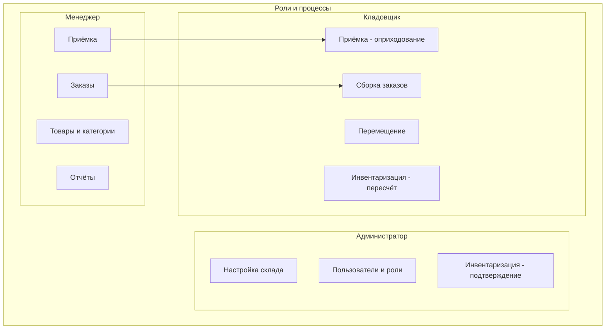

# BPMN-процессы Bashkent WMS (краткая сводка)

Упрощённое описание процессов в стиле BPMN: события (кружки), задачи (прямоугольники), шлюзы (ромбы).

---

## Сводная схема: кто что делает

---

## Приём товара (детально)

| BPMN-элемент | Описание |
|--------------|----------|
| **Старт** | Поступление товара от поставщика |
| **Задача** | Создать документ приёмки, указать поставщика |
| **Задача** | Добавить строки (товар, ячейка размещения, количество) или сканировать штрихкоды |
| **Шлюз** | Все строки заполнены? |
| **Задача** | Сохранить документ → автоматическое обновление StockBalance |
| **Конец** | Остатки увеличены, документ в истории |

---

## Отгрузка заказа (детально)

| BPMN-элемент | Описание |
|--------------|----------|
| **Старт** | Поступил заказ клиента |
| **Задача** | Создать заказ, добавить строки (товар, количество) |
| **Событие** | Статус «Создан» |
| **Задача** | Перевести в «Собирается», собрать по ячейкам (сканирование) |
| **Задача** | Перевести в «Отправлен» |
| **Задача** | Система списывает остатки (FIFO по ячейкам) |
| **Конец** | Товар отгружен, остатки уменьшены |

---

## Перемещение (детально)

| BPMN-элемент | Описание |
|--------------|----------|
| **Старт** | Необходимость переноса товара между ячейками |
| **Задача** | Создать документ перемещения |
| **Задача** | Указать: товар, ячейка «из», ячейка «в», количество |
| **Шлюз** | В ячейке «из» достаточно остатка? |
| **Нет** | Ошибка, отмена |
| **Да** | Сохранить → списать с «из», добавить в «в» |
| **Конец** | Остатки обновлены |

---

## Инвентаризация (детально)

| BPMN-элемент | Описание |
|--------------|----------|
| **Старт** | Решение провести инвентаризацию по складу |
| **Задача** | Создать документ, выбрать склад |
| **Задача** | Внести факт по товарам/ячейкам (системное кол-во подставляется) |
| **Задача** | Пересчёт: ввести фактическое количество |
| **Шлюз** | Есть расхождения? |
| **Нет** | Завершить без изменений |
| **Да** | Сформировать акт, применить корректировку → обновить StockBalance |
| **Конец** | Учёт приведён к факту |

---

Для полных схем и архитектуры см. [ARCHITECTURE_AND_BPMN.md](./ARCHITECTURE_AND_BPMN.md).
